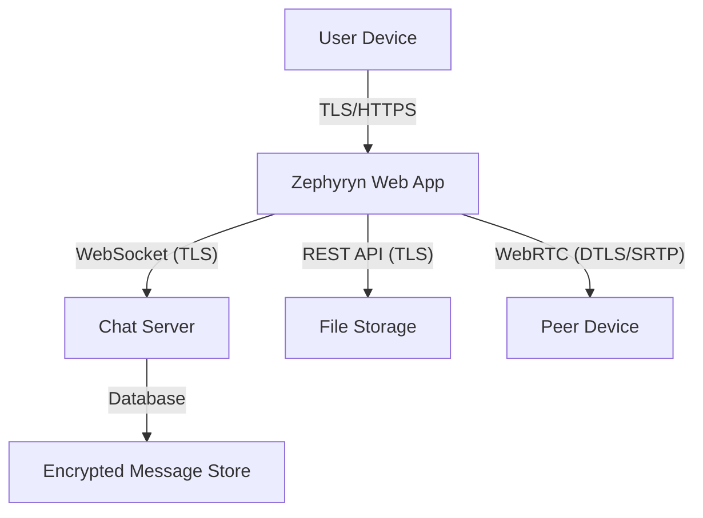
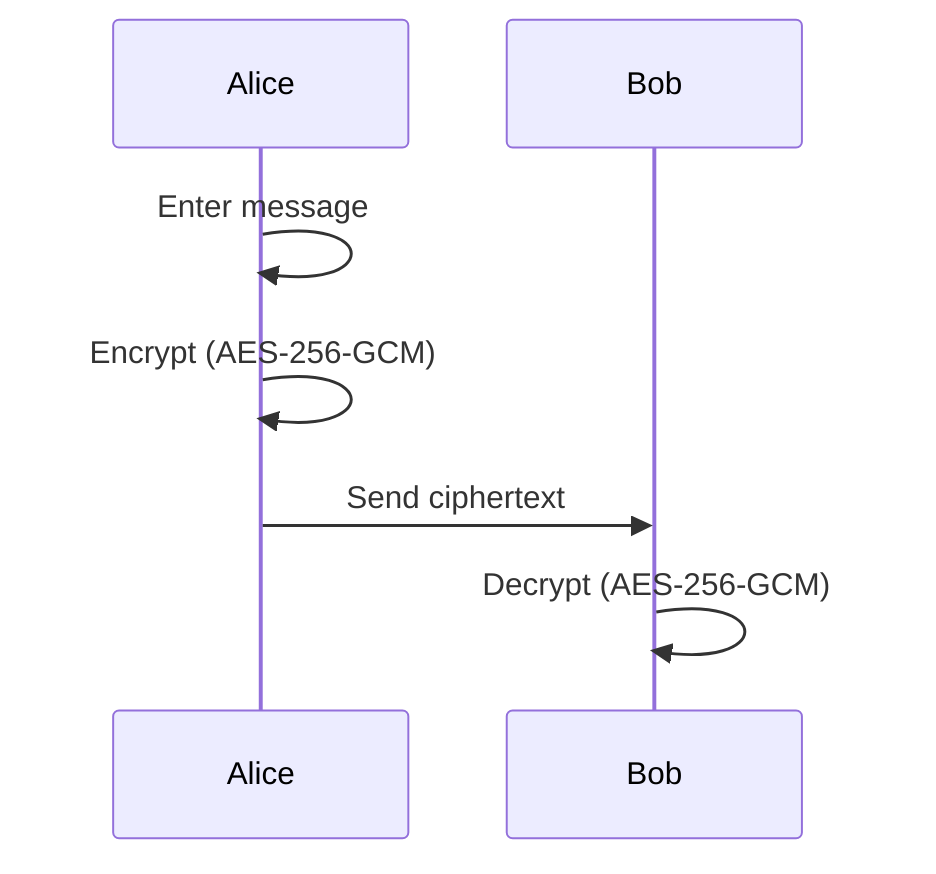
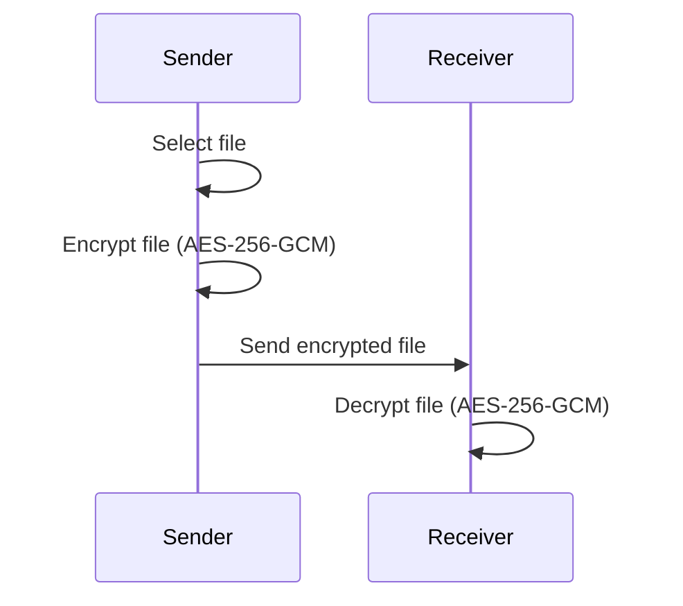
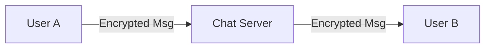
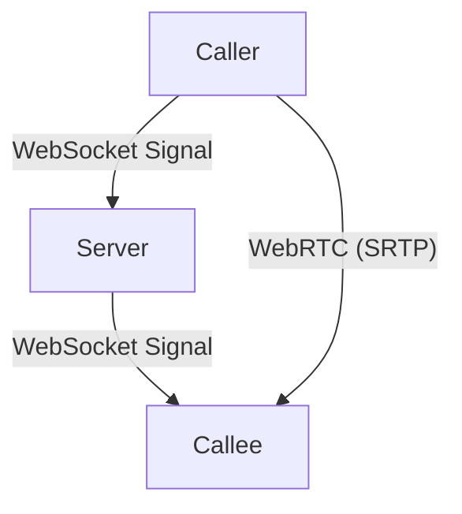

# Zephyryn Platform: Technical Overview & Security Architecture

---

## Table of Contents
1. [Introduction](#introduction)
2. [Platform Architecture](#platform-architecture)
3. [Cryptography Fundamentals](#cryptography-fundamentals)
4. [Text Encryption & Decryption](#text-encryption--decryption)
5. [File Encryption & Decryption](#file-encryption--decryption)
6. [Secure Chat System](#secure-chat-system)
7. [Secure Voice & Video Calls](#secure-voice--video-calls)
8. [Key Management & Exchange](#key-management--exchange)
9. [Security Best Practices](#security-best-practices)
10. [Threat Model & Mitigations](#threat-model--mitigations)

---

## 1. Introduction
Zephyryn is a next-generation, end-to-end encrypted communication platform designed for secure messaging, file sharing, and real-time voice/video calls. It leverages modern cryptography, a glassmorphic UI, and a scalable architecture to deliver privacy and usability.

---

## 2. Platform Architecture

- **Frontend**: React/Next.js app with glassmorphic UI, runs in browser.
- **Backend**: Node.js chat server (WebSocket), REST APIs for file storage.
- **Voice/Video**: Peer-to-peer via WebRTC, with signaling over secure WebSocket.
- **All communication is encrypted in transit (TLS/HTTPS).**

---

## 3. Cryptography Fundamentals
- **Symmetric Encryption**: AES-256-GCM for text and file encryption.
- **Asymmetric Encryption**: (Optional) ECDH for key exchange, RSA for sharing keys.
- **Key Derivation**: PBKDF2 or Argon2 for user-supplied passphrases.
- **Integrity**: GCM mode provides authentication; HMAC for additional checks.
- **Randomness**: Cryptographically secure random number generators for keys/IVs.

---

## 4. Text Encryption & Decryption
### Flow
1. **User enters text** in the UI.
2. **Key selection**: User provides or generates a symmetric key (AES-256).
3. **Encryption**: Text is encrypted client-side using AES-256-GCM.
4. **Transmission**: Encrypted text is sent to the recipient (never in plaintext).
5. **Decryption**: Recipient uses the shared key to decrypt the message.

- **Keys are never sent to the server.**
- **Encryption is always performed in the browser.**

---

## 5. File Encryption & Decryption
### Flow
1. **User selects file** to send.
2. **Key selection**: User provides/generates a symmetric key.
3. **Encryption**: File is encrypted in the browser (streaming for large files).
4. **Upload**: Encrypted file is uploaded to storage.
5. **Download/Decryption**: Recipient downloads and decrypts with the shared key.

- **Files are never stored or transmitted unencrypted.**
- **Supports large files via chunked/streaming encryption.**

---

## 6. Secure Chat System
### Architecture
- **WebSocket-based real-time chat**
- **All messages encrypted client-side**
- **Session keys**: Each chat session uses a unique symmetric key
- **Message flow:**
  1. User A types a message, encrypts with session key
  2. Sends ciphertext via WebSocket
  3. Server relays (never decrypts)
  4. User B receives and decrypts

- **Offline messages**: Stored encrypted, only decrypted by recipient.
- **Forward secrecy**: (Optional) New key per session or per message.

---

## 7. Secure Voice & Video Calls
### WebRTC + End-to-End Encryption
- **Signaling**: Secure WebSocket for call setup
- **Media**: Peer-to-peer via WebRTC, encrypted with DTLS/SRTP
- **Key exchange**: ECDH or pre-shared keys for SRTP
- **No media ever passes through the server unencrypted**

- **Perfect Forward Secrecy**: Ephemeral keys for each call
- **Optional recording**: Only with explicit user consent, encrypted at rest

---

## 8. Key Management & Exchange
- **User-generated keys**: Users can generate, import, or export keys
- **Key QR codes**: For easy sharing between devices
- **Key storage**: In browser localStorage (never sent to server)
- **Key exchange**: Out-of-band (QR, manual entry, or E2E handshake)
- **Key rotation**: Users can rotate keys at any time

---

## 9. Security Best Practices
- **Zero Knowledge**: Server never sees plaintext or keys
- **Client-side encryption**: All sensitive operations in browser
- **TLS everywhere**: All network traffic is encrypted
- **No password reuse**: Encourage strong, unique passphrases
- **Regular audits**: Code and cryptography reviewed regularly
- **Open source**: Transparent codebase for community review

---

## 10. Threat Model & Mitigations
| Threat                        | Mitigation                                      |
|-------------------------------|-------------------------------------------------|
| Server compromise             | No plaintext/keys on server                      |
| Man-in-the-middle (MITM)      | TLS, key verification, QR/manual key exchange    |
| Device compromise             | User education, local encryption, session expiry |
| Replay attacks                | Nonces, message authentication                  |
| Brute force on keys           | Strong key derivation, minimum key length        |
| Social engineering/phishing   | User warnings, key verification steps            |

---

## Appendix: Real-World Analogies
- **Encrypted chat**: Like sending a locked box with a key only you and your friend have.
- **File encryption**: Like putting files in a safe before mailing them.
- **Voice/video calls**: Like using a private, scrambled phone line.
- **Key exchange**: Like meeting in person to share a secret handshake.

---

*For more details, see the codebase and in-line documentation. Zephyryn is designed for privacy, security, and usability from the ground up.* 